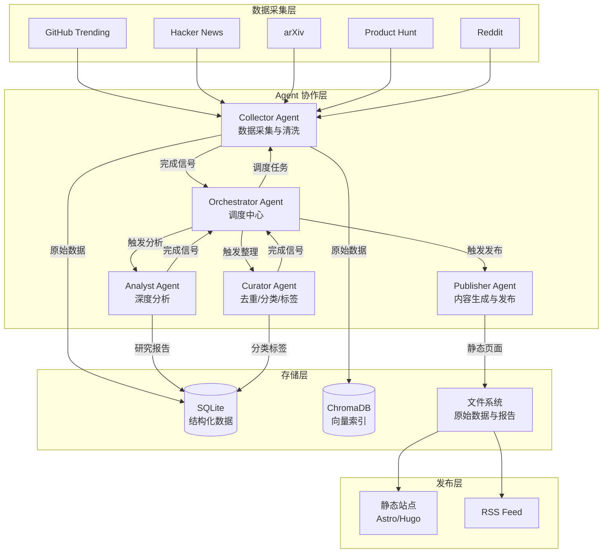

# AI Knowledge Base - 项目愿景文档

## 1. 项目概述

AI 领域正经历前所未有的信息爆炸：每天有数百篇新论文发布在 arXiv 上，GitHub 上不断涌现新的 AI/ML 开源项目，Hacker News 和各类技术社区中 AI 相关讨论持续升温。对于个人开发者而言，即使全职关注，也难以系统性地跟踪、理解并沉淀这些前沿动态。信息碎片化、重复内容多、深度分析匮乏——这三重困境使得"跟上 AI 进展"本身成为一项低效且令人疲惫的工作。本项目旨在构建一套全自动化的个人 AI 研究助手系统，通过多 Agent 协作，实现从数据采集、深度分析、知识体系化到内容发布的完整闭环，让用户以最少的时间投入获取最高质量的前沿洞察。

## 2. 愿景声明

构建一个全自动运行的个人 AI 研究助手——每日自动采集全球 AI 前沿动态，经深度分析后生成结构化研究报告，以静态站点形式持续发布，真正实现"零人工干预的知识管理系统"。

## 3. 核心价值主张

- **自动化信息采集**：覆盖 GitHub、arXiv、Hacker News 等主流 AI 信息源，每日定时抓取，消除人工浏览的重复劳动
- **深度 AI 分析**：借助 LLM 对每条信息进行多维度分析，生成具备背景、创新点、技术原理、实验结果、对比与个人见解的研究级报告，而非简单的摘要翻译
- **知识体系化**：通过去重、分类、标签和知识图谱，将碎片化信息组织为可持续积累的个人知识库
- **零人工干预**：从采集到发布的全链路自动化，系统在无人值守状态下持续运行，用户只需阅读最终输出
- **可追溯与可扩展**：所有原始数据、分析过程和最终产出均持久化存储，支持随时回溯；数据源和分析维度可灵活扩展

## 4. 数据源

### 首期接入（V1）

| 数据源 | 采集内容 | 频率 | 采集方式 |
|--------|---------|------|---------|
| GitHub Trending | AI/ML 分类下的 trending 仓库（stars、描述、语言、最近活跃度） | 每日 | GitHub API / 页面解析 |
| Hacker News | AI 相关 top posts（标题、链接、评论数、得分） | 每日 | Official API + 关键词过滤 |
| arXiv | cs.AI、cs.LG、cs.CL 分类下的新论文（标题、摘要、作者、链接） | 每日 | arxiv.py SDK |

### 扩展数据源（V2+）

| 数据源 | 采集内容 | 说明 |
|--------|---------|------|
| Product Hunt | AI 类别新产品发布 | 捕捉工具和应用层面的创新，补充学术和开源视角 |
| Reddit r/MachineLearning | 热门讨论帖 | 获取社区对技术的实际反馈和争议观点，补充纯信息源缺乏的讨论维度 |
| Semantic Scholar / Papers With Code | 论文引用关系、代码实现 | 用于构建知识图谱中的引用链和关联关系 |

## 5. 系统架构



### Agent 职责定义

- **Orchestrator Agent**：全局调度中心，管理任务队列、控制执行顺序、处理 Agent 间依赖关系、监控健康状态、触发错误恢复流程
- **Collector Agent**：从各数据源采集原始数据，执行基础清洗（去 HTML 标签、统一编码、提取关键字段），将结构化数据写入 SQLite，同时生成向量 embedding 写入 ChromaDB
- **Analyst Agent**：对采集到的每条数据进行深度分析，调用 LLM 生成结构化研究报告，包含背景、创新点、技术原理、实验结果、对比分析和个人见解
- **Curator Agent**：基于向量相似度和 LLM 判断进行跨源去重，执行主题分类、打标签、排序，维护知识图谱关联
- **Publisher Agent**：根据整理后的数据生成 Markdown 内容，按模板渲染为静态站点页面，处理站点构建和部署

## 6. Agent 协作流程

### 端到端执行流程

```
[每日定时触发]
       |
       v
  Orchestrator 创建当日 Pipeline
       |
       v
  Collector Agent 执行采集
  ├── 输入：数据源配置、采集规则
  ├── 处理：并行抓取各数据源 → 清洗 → 结构化
  ├── 输出：SQLite 原始记录 + ChromaDB 向量
  └── 错误处理：单源失败不阻塞其他源，记录失败日志，标记待重试
       |
       v
  Analyst Agent 执行分析
  ├── 输入：当日新增的原始记录
  ├── 处理：逐条调用 LLM 进行深度分析，生成研究报告
  ├── 输出：结构化研究报告（存入 SQLite）
  └── 错误处理：LLM 调用失败自动重试 3 次（指数退避），超过阈值跳过并标记
       |
       v
  Curator Agent 执行整理
  ├── 输入：当日分析报告 + 历史数据（用于去重对比）
  ├── 处理：向量相似度去重 → LLM 辅助判定 → 主题分类 → 打标签 → 排序
  ├── 输出：整理后的分类目录和标签索引
  └── 错误处理：去重服务异常时降级为仅基于规则的去重
       |
       v
  Publisher Agent 执行发布
  ├── 输入：整理后的报告和索引数据
  ├── 处理：生成 Markdown → 套用模板 → 构建静态站点 → 部署
  ├── 输出：更新的静态站点 + RSS Feed
  └── 错误处理：构建失败保留上一版本，发送通知
       |
       v
  Orchestrator 记录执行结果，发送状态汇总
```

### 调度策略

- **主调度**：每日 UTC 02:00（北京时间 10:00）通过 GitHub Actions cron 触发完整 Pipeline
- **增量采集**：Hacker News 和 arXiv 每日执行，GitHub Trending 每日执行，Product Hunt 和 Reddit 每 12 小时执行一次
- **超时控制**：单个 Agent 执行超时上限 30 分钟，整体 Pipeline 超时上限 2 小时
- **幂等保障**：所有写入操作基于日期和数据源 ID 做幂等校验，重复执行不会产生重复数据

## 7. 发布形式

### 静态站点

采用 Astro 或 Hugo 构建静态站点，部署至 GitHub Pages。选择静态站点的理由：零运维成本、加载速度快、天然支持版本控制、可离线阅读。

### 内容类型

| 内容类型 | 发布频率 | 内容说明 |
|---------|---------|---------|
| 每日快报 | 每日 | 当日采集条目的概览，含标题、一句话摘要、来源链接、分类标签 |
| 每周深度报告 | 每周日 | 本周重要条目的完整研究报告，含技术分析和对比 |
| 月度趋势 | 每月末 | 当月汇总统计、热点主题分析、技术趋势研判 |

### 输出渠道

- **静态站点**：主要内容载体，支持搜索、分类浏览、时间线浏览
- **RSS Feed**：提供标准 RSS 订阅，方便通过阅读器追踪更新
- **Git 仓库**：所有原始数据和分析报告以 Markdown 形式存储在 Git 仓库中，便于版本管理和回溯

## 8. 技术栈推荐

### Agent 框架：CrewAI

选择 CrewAI 而非 LangGraph 的理由：CrewAI 以 Agent 角色定义为核心，天然适配本项目的"多个专职 Agent 协作"模式；其声明式的任务编排和内置的 Agent 间通信机制显著降低了编排复杂度。LangGraph 更适合需要精细控制状态机的场景，但对本项目而言属于过度设计。

### LLM：DeepSeek API

DeepSeek 在代码理解和长文本分析方面表现优秀，且 API 定价显著低于 OpenAI GPT-4。对于本项目的分析任务（论文摘要理解、技术对比、报告生成），DeepSeek 完全胜任。API Key 已就绪，无需额外采购。

### 数据存储：SQLite + ChromaDB

- **SQLite**：存储结构化元数据（标题、来源、日期、分类、标签等）。选择理由：零配置、单文件部署、查询能力足够、备份简单
- **ChromaDB**：存储文本向量 embedding，支持语义搜索和相似度去重。选择理由：轻量级、Python 原生、本地部署无需外部服务

### 数据采集：httpx + BeautifulSoup / PyGithub / arxiv.py / feedparser

- **httpx + BeautifulSoup**：用于需要页面解析的数据源（如 GitHub Trending 页面），httpx 支持异步请求
- **PyGithub**：GitHub API 的官方 Python 封装，处理 rate limiting 和分页
- **arxiv.py**：arXiv API 的成熟 Python 客户端，支持按分类和时间范围查询
- **feedparser**：统一处理 RSS/Atom feed，用于 Hacker News 和 Reddit 的数据获取

### 站点生成：Astro 或 Hugo

- **Astro**：如果未来需要交互功能（搜索、筛选），Astro 的 Islands 架构可以按需引入前端框架，同时保持静态站点的性能优势
- **Hugo**：如果追求极致简洁和构建速度，Hugo 是更成熟的选择，模板生态丰富
- 初期推荐 Hugo，降低复杂度；V3 阶段视需求迁移至 Astro

### CI/CD 与部署：GitHub Actions + Docker

- **GitHub Actions**：提供免费的 cron 调度和运行环境，与代码仓库天然集成
- **Docker**：容器化运行环境，确保本地开发和 CI 环境的一致性，简化依赖管理

## 9. 分析深度定义

系统生成的"研究报告"不是简单的摘要翻译，而是具备以下结构的深度分析：

1. **背景**：该技术/项目/论文出现的上下文——解决了什么问题，为什么现在重要
2. **核心创新点**：与已有方案的本质区别，用 2-3 句话精炼概括
3. **技术原理**：关键方法、架构或算法的核心思路，避免公式堆砌，重在直觉理解
4. **实验结果**：主要评测指标和表现，与 baseline 的对比数据
5. **与现有方案对比**：在同类技术/工具中的定位，优势和局限
6. **潜在影响**：对实际应用场景、研究社区或行业的可能影响
7. **个人见解**：基于用户的技术背景和关注领域，给出值得关注的理由和建议行动（如：值得阅读原文、值得试用、值得关注后续进展）

每份报告预期 500-1000 字，确保信息密度而非长度。

## 10. 里程碑规划

### V1 - MVP（2-3 周）

**目标**：验证核心链路——从采集到发布的最小可用闭环

- 接入 GitHub Trending 和 arXiv 两个核心数据源
- 实现 Collector 的基础采集和清洗
- 实现 Analyst 的摘要级分析（非完整研究报告，V1 简化）
- 生成每日快报页面，部署至 GitHub Pages
- 基础 SQLite 存储
- GitHub Actions 每日自动触发

**交付标准**：系统在无人干预下连续运行 7 天，每日稳定产出快报页面

### V2 - 多 Agent 协作（2-3 周）

**目标**：引入完整 Agent 协作和深度分析能力

- 实现 Orchestrator 调度全部 Agent
- Analyst 升级为完整研究报告（按第 9 节定义的深度）
- 接入 Hacker News 数据源
- Curator 实现基础去重和分类
- 每周深度报告自动生成
- RSS Feed 输出

**交付标准**：每日快报 + 每周深度报告稳定产出，去重准确率 > 80%

### V3 - 知识体系化（2-3 周）

**目标**：从信息聚合升级为知识管理

- 语义去重：基于 ChromaDB 向量相似度 + LLM 判定的混合去重
- 知识图谱：构建论文/项目间的引用和关联关系
- 智能推荐：基于历史阅读和关注主题的相关内容推荐
- 接入 Product Hunt 和 Reddit 扩展数据源
- 月度趋势报告

**交付标准**：去重准确率 > 95%，知识图谱可可视化展示关联

### V4 - 进阶特性（Future）

- 多语言支持：英文内容自动生成中文分析报告
- 社区反馈整合：自动汇总 Hacker News 和 Reddit 上的高赞评论作为观点补充
- 个性化定制：支持用户定义关注主题、排除规则、分析偏好
- API 开放：提供查询接口，支持与其他工具集成

## 11. 成功指标

| 指标 | 定义 | 目标值 |
|------|------|--------|
| 采集覆盖率 | 每日目标数据源中成功采集的比例 | > 95% |
| 分析完成率 | 采集条目中成功生成研究报告的比例 | > 90% |
| 去重准确率 | 识别为重复的内容中确实是重复的比例 | V2: > 80%, V3: > 95% |
| 发布准时率 | 在计划时间窗口内完成发布的比例 | > 98% |
| 报告可用性 | 报告内容可直接用于学习决策的比例（主观评估） | 用户自评，持续优化 |
| 系统可用性 | 每月成功完成 Pipeline 执行的天数占比 | > 95% |
| 学习效率提升 | 相比手动浏览，达到同等信息覆盖所需时间的缩减 | 目标缩减 80% 以上 |

## 12. 风险与缓解

| 风险 | 影响 | 概率 | 缓解措施 |
|------|------|------|---------|
| **API Rate Limiting** | 采集中断或 LLM 分析受限 | 高 | 实现请求队列和速率控制；对 GitHub API 使用 ETag 缓存避免重复请求；LLM 调用采用批量处理减少请求次数 |
| **LLM 幻觉** | 研究报告中出现事实错误 | 中 | 报告中明确标注"AI 生成"；关键技术声明附带原文链接供核实；定期抽样人工审核报告质量 |
| **数据源结构变更** | 采集脚本失效 | 中 | 页面解析逻辑与核心逻辑解耦；采集失败时立即告警而非静默失败；为关键数据源优先使用官方 API 而非页面解析 |
| **LLM 成本失控** | 每日运行成本超出预期 | 低 | 设置每日 LLM 调用 token 上限；优先对高价值条目进行深度分析，低价值条目仅生成摘要；监控每日用量并在接近阈值时自动降级 |
| **分析质量下降** | 报告内容空洞或泛泛而谈 | 中 | 建立分析质量 checklist 作为 LLM prompt 约束；定期迭代 prompt 模板；保留人工反馈入口用于持续改进 |
| **存储膨胀** | SQLite 和 ChromaDB 数据量持续增长 | 低 | 设计数据归档策略（原始数据保留 90 天热数据，更早的归档至文件）；定期清理 ChromaDB 中低价值向量；监控存储使用量 |
